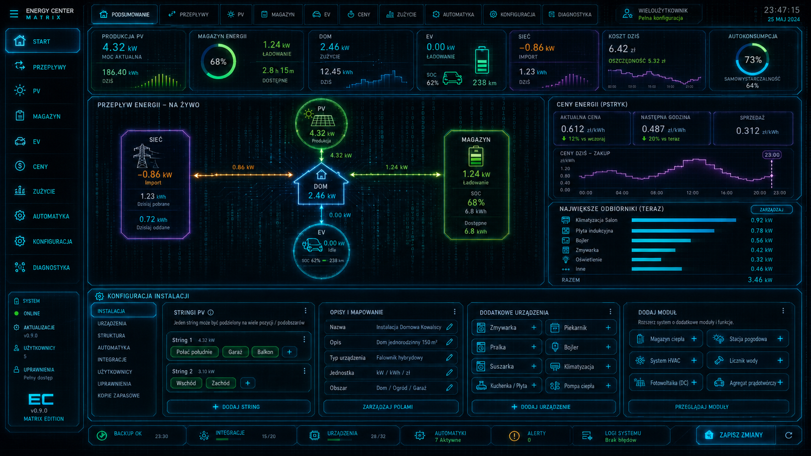

# Matrix Energy Center



**Matrix Energy Center** is a local, multi-user energy management panel for Home Assistant. It provides a Matrix Blue interface, live power flows, normalized energy sensors and a complete configuration editor for grid, photovoltaic strings, battery storage, EV charging, tariffs and arbitrary appliances.

> Status: **v0.6.4 technical preview**. Monitoring, configuration, the multi-branch flow window, native Lovelace flow card, advanced overview widgets, Recorder-backed charts, multi-profile kiosk mode, the TAURON G13 tariff engine and generic control buttons are implemented. Automatic control of inverters, batteries and EV chargers remains intentionally disabled until vendor adapters and safety tests are added.

## Main features

- Custom sidebar panel with Matrix Blue styling and responsive desktop/mobile layout.
- Configurable live flow diagram: PV strings and additional sources → PV/home, grid ↔ home ↔ battery, and home ↔ EV/additional devices.
- Separate graphic nodes for multiple PV strings, including independent live power and status.
- Optional flow nodes for arbitrary devices configured as a source, consumer or bidirectional device.
- Flow-window editor with live preview, layout, node style, animation speed, visibility, item limits, order and spacing controls.
- Configurable overview bubbles for any Home Assistant entity or entity attribute.
- Per-bubble name, description, MDI icon, independent frame/background/icon/name/value/unit/description colors, frame width/radius, sizes, padding, alignment, unit, precision, multiplier, order and session sparkline.
- A secondary value and up to eight related entities inside one bubble, each with its own label, value and unit colors, size, unit, precision and multiplier.
- Fixed or threshold-driven bubble colors, unavailable/alarm colors and visual alerts.
- Additional line, area and grouped bar charts with up to nine related series on one shared timeline.
- Session, 24-hour, 7-day and 30-day history ranges backed by Home Assistant Recorder/Statistics when available.
- Click actions for bubbles and charts: more-info dialog, local navigation or a Home Assistant service call.
- Drag-and-drop bubble/chart ordering in the Widgets editor.
- Dedicated **Widgets** editor with live preview and optional hiding of the standard overview bubbles.
- Full-screen **Kiosk** dashboards with optional clock/status, selectable bubbles/charts, named screen profiles, automatic slide rotation, night dimming, three flow-diagram heights and a Samsung Galaxy Tab A9 landscape 16:9 preset.
- Touch layout editing in kiosk mode: drag and resize bubbles, move/scale the complete flow diagram and save positions per screen profile.
- Independently selectable built-in kiosk bubbles and summary panels; battery and self-sufficiency gauges are optional.
- Up to twelve local Lovelace views can be added as kiosk slides and included in automatic rotation.
- Native `custom:matrix-energy-flow-card` for Lovelace dashboards; no self-iframe or reserved-character URL workaround is required.
- Generic source mapping; no user entity IDs are hardcoded.
- Normalized Home Assistant sensors in W, kWh, %, currency/kWh and currency/hour.
- Signed grid and battery power with configurable direction conventions.
- Unlimited PV strings within practical storage limits.
- Each string can be divided into multiple sections such as roof faces, garage, balcony or separate sub-arrays.
- Section metadata: orientation, tilt, panel count, peak power, percentage share, power/energy entities and description.
- Arbitrary appliances: dishwasher, washing machine, dryer, oven, cooktop, heat pump, HVAC, servers and custom devices.
- Appliance metadata: name, description, room, MDI icon, category, accent, power entity, energy entity and optional control entity.
- Built-in editable **TAURON G13** engine with summer/winter schedules, weekends, Polish public holidays, custom holidays and the next-zone calculation.
- Separate energy, distribution, variable and monthly fixed fee components, plus combined-price and external-price modes.
- Administrator-only backend writes; optional read-only configuration view for regular users.
- Local JSON import/export of project configuration.
- Diagnostics view for entity availability, units, device classes, tariff state and runtime values.
- English and Polish configuration-flow translations.
- HACS-ready repository layout, HACS and Hassfest workflows.
- Responsive CSS-grid flow canvas with source/load branch buses whose connectors remain aligned with their nodes.
- Live module visibility: enabling or disabling a module immediately rebuilds navigation, overview metrics, flow nodes and configuration sections.
- Home Assistant-style entity search over the live state registry, including friendly name, entity ID, current state, unit, device class, device, area and source integration.
- Extended mappings for grid quality, inverter diagnostics, PV forecasts, BMS data, EV charging details and day/month costs.
- Live appliance state descriptions based on configurable working and standby thresholds.

## Installation through HACS as a custom repository

1. Publish this folder as a public GitHub repository.
2. In HACS open **Custom repositories**.
3. Add `https://github.com/grehell/grehell-matrix-energy-center` and choose **Integration**.
4. Install **Matrix Energy Center** and restart Home Assistant.
5. Open **Settings → Devices & services → Add integration**.
6. Search for **Matrix Energy Center**.
7. Open the new **Energy Center** item in the sidebar and configure entity mappings.

## Manual installation

Copy:

```text
custom_components/matrix_energy_center
```

to:

```text
/config/custom_components/matrix_energy_center
```

Restart Home Assistant and add the integration from the UI.

## Native Lovelace card

Version 0.6.4 registers its Lovelace module automatically. After restarting Home Assistant and performing a hard browser refresh, add a **Manual** card:

```yaml
type: custom:matrix-energy-flow-card
profile: default
title: PRZEPŁYW ENERGII
height: 720
show_header: true
show_bubbles: true
show_custom_bubbles: true
show_pv_strings: true
show_devices: true
```

Set `profile` to a configured kiosk profile ID such as `salon` to reuse its bubble selection and title. This YAML belongs to a card, not to the Lovelace view configuration.

## Configuration model

The setup flow creates only the installation entry. Detailed configuration is managed inside the custom panel and stored locally in Home Assistant `.storage`.

```text
Grid / PV / Battery / EV / Tariff / Appliances
                      ↓
             user-selected entities
                      ↓
       Matrix Energy Center normalization
                      ↓
       dashboard + normalized HA sensors
```

The project never contains private entity IDs, IP addresses, usernames, tokens or credentials.

## TAURON G13

Version 0.6 retains the complete editable G13 profile and configurable multi-branch energy-flow window, and extends the overview and kiosk presentation. The default schedule follows TAURON's published rules:

- summer period: 1 April–30 September,
- winter period: 1 October–31 March,
- morning peak: 07:00–13:00,
- summer afternoon peak: 19:00–22:00,
- winter afternoon peak: 16:00–21:00,
- remaining hours are off-peak,
- Saturdays, Sundays and Polish public holidays are off-peak all day,
- after a day off, the off-peak period continues until 07:00 on the next workday.

The schedule is editable because the project is intended for many users and future tariff revisions. Three price modes are available:

1. **Components** — energy sale price + variable distribution + other variable fees.
2. **Combined** — one complete gross purchase price for each season and zone.
3. **Entity** — a price supplied by an external Home Assistant sensor.

The bundled `tauron_g13_2026_gross` preset includes the 2026 gross TAURON Dystrybucja variable distribution rates and common regulated variable/fixed fee defaults. Energy sale rates are deliberately zero until the user enters values from their own agreement or price list. See [TAURON G13 configuration](docs/TAURON_G13_PL.md).

Official references used for the initial preset:

- https://www.tauron.pl/dla-domu/prad/taryfa-sprzedawcy/g13
- https://www.tauron-dystrybucja.pl/uslugi-dystrybucyjne/stawki-oplat-dystrybucyjnych

## Normalized sensors

The integration creates entities for:

- home power,
- signed grid power,
- grid import/export power,
- grid import/export energy,
- PV power and today's PV energy,
- signed battery power,
- battery charge/discharge power,
- battery SOC and available energy,
- EV charging power and SOC,
- purchase/sale price,
- live self-sufficiency and PV self-consumption,
- active G13 zone, season and day type,
- G13 energy, distribution, surcharge and total price components,
- monthly fixed tariff charges,
- next G13 zone and minutes to change,
- current grid-import cost per hour.

## PV string splitting

A string can work as one measurement source or be divided into multiple sections.

Example:

```text
String 1 — MPPT 1
├── South roof — 10 panels — 4.5 kWp — 70%
├── Garage — 3 panels — 1.2 kWp — 20%
└── Balcony — 2 panels — 0.8 kWp — 10%
```

A section may have its own sensor. When only a string-level sensor exists, the percentage share remains available for later analytical allocation.

## Appliance controls

Version 0.6 supports generic control buttons for:

- `switch.*`
- `input_boolean.*`
- `light.*`
- `button.*`

Other domains will receive dedicated adapters in later versions.

## Security and privacy

- All configuration stays local.
- Configuration writes and resets require an administrator account.
- There is no telemetry.
- No cloud service is required.
- Automatic energy control is disabled by default.

## Known technical-preview limitations

- Recorder history depends on the selected entities being retained by Home Assistant; efficient long-term 7/30-day series require compatible Statistics metadata and otherwise fall back to ordinary history.
- The tariff engine calculates the active price and live cost rate, but persistent day/month invoice aggregation is not yet implemented.
- Energy prices and fixed fees must be reviewed whenever the user's contract or official tariff changes.
- Automatic inverter, battery and EV control is not executed in v0.6.
- Dynamic per-appliance entities are not created yet; additional appliances are displayed and managed in the panel.

## Documentation

- [Polish installation guide](docs/INSTALL_PL.md)
- [TAURON G13 configuration (PL)](docs/TAURON_G13_PL.md)
- [Architecture](docs/ARCHITECTURE.md)
- [Roadmap](docs/ROADMAP.md)
- [Status wersji v0.6 (PL)](docs/STATUS_PL.md)
- [Informacje o wydaniu v0.6.4 (PL)](docs/RELEASE_0_6_4_PL.md)
- [Publikacja plików na GitHub (PL)](docs/UPLOAD_GITHUB_PL.md)
- [Example configuration](docs/example-config.json)

## License

MIT
